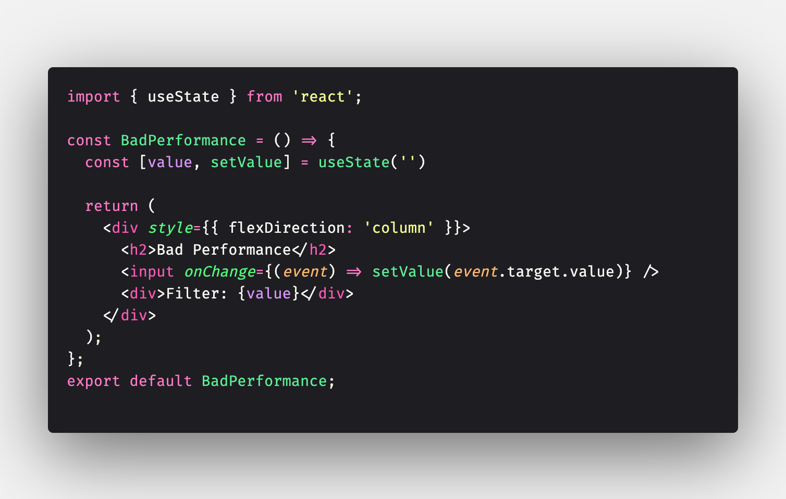
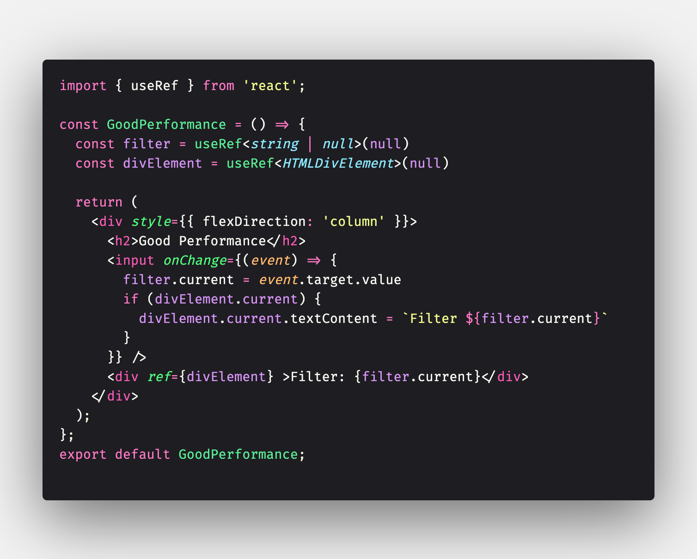
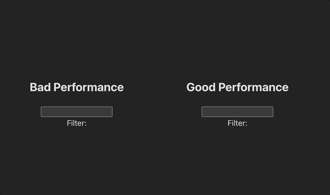

## 💻 Performance in React:

- Bad performance, when we using the hook useState;
- Several renders happen

 
- when we using refs, have renders only specific component

 
- Below we can see an example of this case happen

